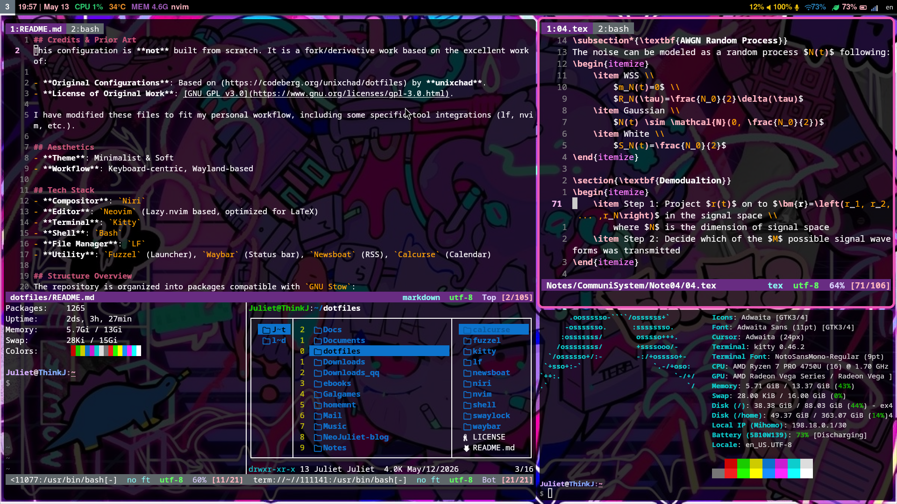

## Credits & Prior Art
This configuration is **not** built from scratch. It is a fork/derivative work based on the excellent work of:

- **Original Configurations**: Based on (https://codeberg.org/unixchad/dotfiles) by **unixchad**.
- **License of Original Work**: [GNU GPL v3.0](https://www.gnu.org/licenses/gpl-3.0.html).

I have modified these files to fit my personal workflow, including some specific tool integrations (lf, nvim, etc.).

## Aesthetics
- **Theme**: Minimalist & Soft
- **Workflow**: Keyboard-centric, Wayland-based

## Tech Stack
- **Compositor**: `Niri`
- **Editor**: `Neovim` (Lazy.nvim based, optimized for LaTeX)
- **Terminal**: `Kitty`
- **Shell**: `Bash`
- **File Manager**: `LF`
- **Utility**: `Fuzzel` (Launcher), `Waybar` (Status bar), `Newsboat` (RSS), `Calcurse` (Calendar)

## Appearance


## Structure Overview
The repository is organized into packages compatible with `GNU Stow`:

- `niri/`: Layout and keybindings for the scroll-stacking compositor.
- `nvim/`: Neovim setup.
- `shell/`: Core environment variables and shell aliases.
- `waybar/` & `fuzzel/`: UI components themed with the Juliet Pink palette.
- `lf/`: Terminal file manager with custom icons and keybindings.

```
.
├── calcurse
│   └── .config
│       └── calcurse
│           ├── conf
│           ├── hooks
│           └── keys
├── fuzzel
│   └── .config
│       └── fuzzel
│           └── fuzzel.ini
├── kitty
│   └── .config
│       └── kitty
│           └── kitty.conf
├── lf
│   └── .config
│       └── lf
│           ├── colors
│           ├── command.conf
│           ├── icons
│           ├── keybinding.conf
│           ├── lfrc
│           └── rifle.conf
├── newsboat
│   └── .config
│       └── newsboat
│           ├── bindings.conf
│           ├── colors.conf
│           ├── config
│           └── urls
├── niri
│   └── .config
│       └── niri
│           └── config.kdl
├── nvim
│   └── .config
│       └── nvim
│           ├── init.lua
│           ├── lazy-lock.json
│           └── lua
│               ├── config
│               │   ├── bindings.lua
│               │   ├── colors.lua
│               │   ├── juliet.lua
│               │   └── options.lua
│               └── plugins
│                   ├── cmp.lua
│                   ├── nvim-lspconfig.lua
│                   ├── rander-markdown.lua
│                   └── vimtex.lua
├── shell
│   ├── .bash_profile
│   ├── .bashrc
│   ├── .inputrc
│   └── .profile
├── swaylock
│   └── .config
│       └── swaylock
│           └── config
└── waybar
    └── .config
        └── waybar
            ├── config.jsonc
            └── style.css
```

## Usage
```bash
# e.g., configure nvim
stow nvim
# remove configure
stow -D nvim
```

