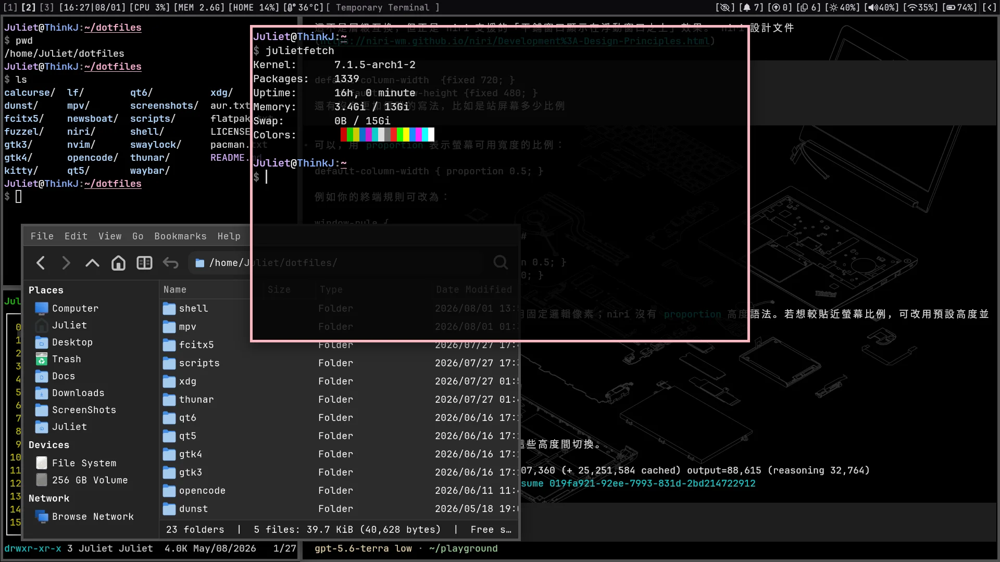
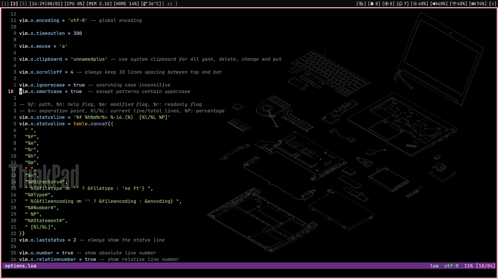
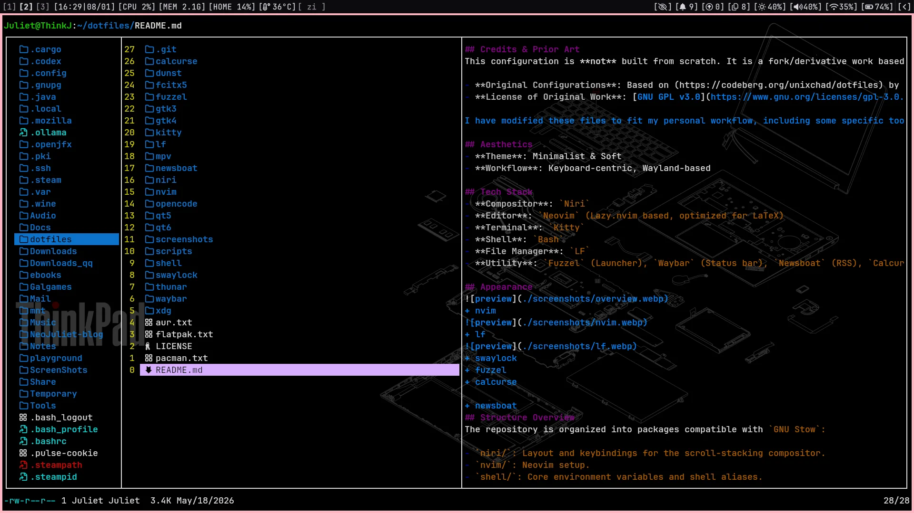

## Credits & Prior Art
This configuration is **not** built from scratch. It is a fork/derivative work based on the excellent work of:

- **Original Configurations**: Based on (https://codeberg.org/unixchad/dotfiles) by **unixchad**.
- **License of Original Work**: [GNU GPL v3.0](https://www.gnu.org/licenses/gpl-3.0.html).

I have modified these files to fit my personal workflow, including some specific tool integrations (lf, nvim, etc.).

## Aesthetics
- **Theme**: Minimalist & Soft
- **Workflow**: Keyboard-centric, Wayland-based

## Tech Stack
- **Compositor**: `Niri`
- **Editor**: `Neovim` (Lazy.nvim based, optimized for LaTeX)
- **Terminal**: `Kitty`
- **Shell**: `Bash`
- **File Manager**: `LF`
- **Utility**: `Fuzzel` (Launcher), `Waybar` (Status bar), `Newsboat` (RSS), `Calcurse` (Calendar)

## Appearance

+ nvim

+ lf

## Usage
```bash
# e.g., configure nvim
stow nvim
# remove configure
stow -D nvim
```

